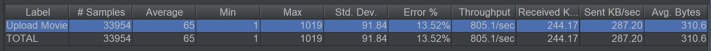
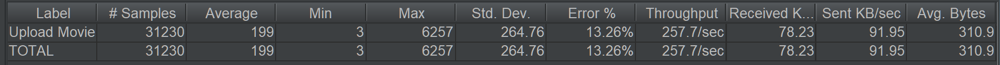
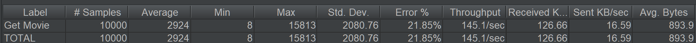
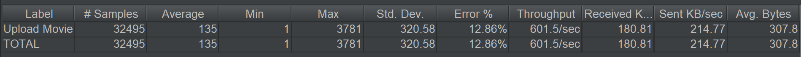
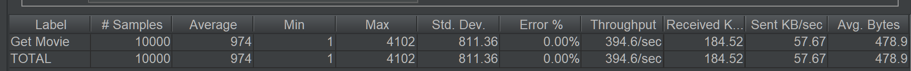
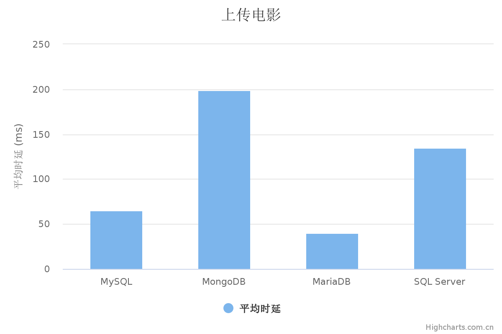
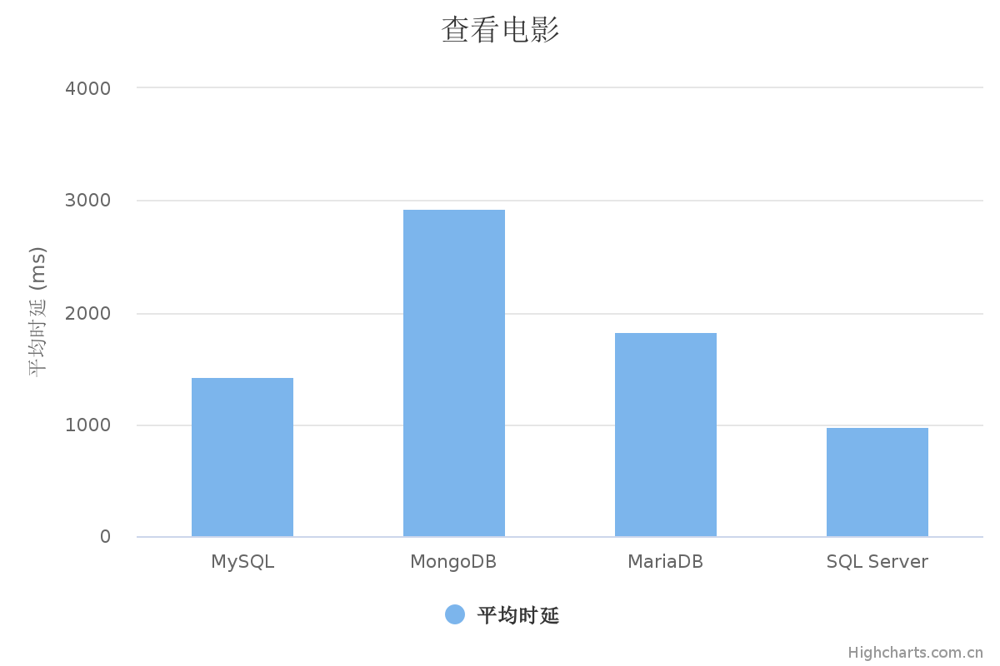
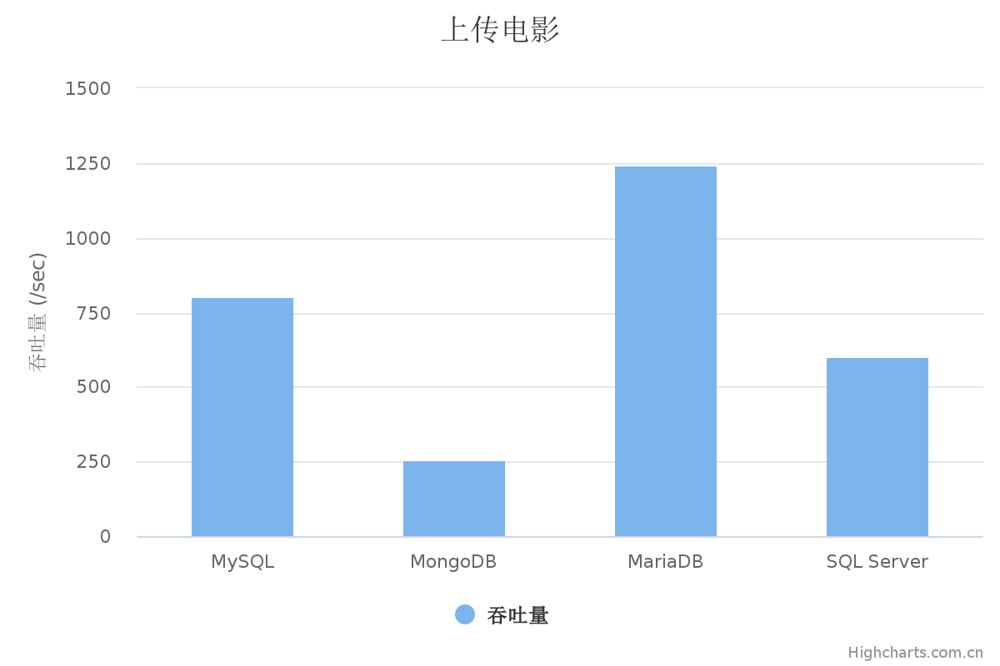
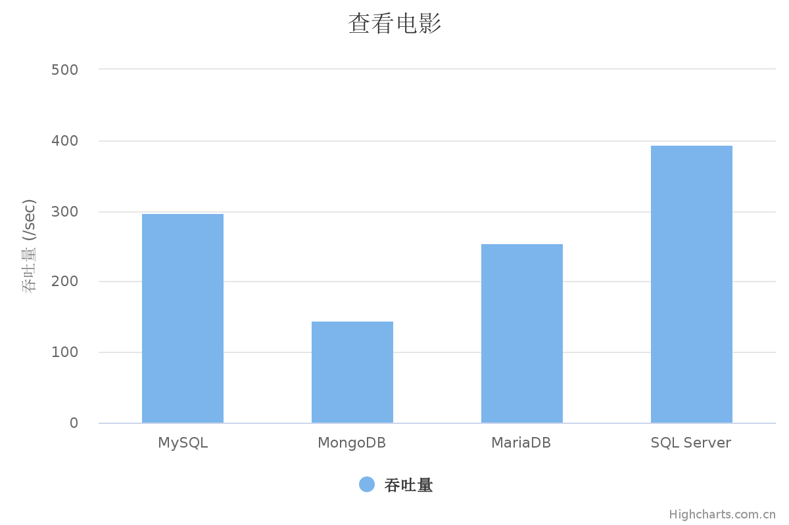

# 测试结果报告

## 流程步骤及工具

1. 开发后端
   * IntelliJ IDEA：Java编程语言开发的集成环境。
   * Spring Boot：由Pivotal团队提供的全新框架，其设计目的是用来简化新Spring应用的初始搭建以及开发过程。
2. 配置数据库
   * MySQL：关系型数据库管理系统，由瑞典MySQL AB公司开发，属于Oracle旗下产品。
   * MongoDB：基于分布式文件存储的数据库，介于关系数据库和非关系数据库之间的产品。
   * MariaDB：数据库管理系统，是MySQL的一个分支。
   * SQL Server：Microsoft公司推出的关系型数据库管理系统。
   * Navicat Premium 15：可多重连接的数据库管理工具。
3. 性能测试
   * JMeter：Apache组织开发的基于Java的压力测试工具。

## 测试用例

测试用例共有两个接口，一是上传电影，主要考察数据库的写性能，二是查看电影信息，主要考察数据库的读性能。测试用例中的电影记录来源于IMDb的公开接口，保存在[`test.csv`](../test.csv)文件中。测试所用脚本保存在[`Http Request.jmx`](../Http Request.jmx)文件中。

* 上传电影

通过POST请求上传10299条电影记录，每条电影记录的数据格式如下，并发量为100，持续30秒。

```json
{
    "movieName": "xxx", // 电影名
    "releaseTime": "yyyy-MM-dd", // 上映日期
    "poster": "xxx", // 海报
    "introduction": "xxx" // 介绍
}
```

* 查看电影

通过GET请求获取10299条电影记录，请求参数为movieName（电影名），并发量为1000，持续20秒。

## 运行结果

以下为JMeter对四种数据库压力测试的结果图。在测试过程中，四种数据库在读写压力的表现变化较为相似。

1. 在并发读的场景下，吞吐量会维持15秒左右的高吞吐，随后吞吐量逐渐下滑至峰值性能的20%左右。
2. 在并发写的场景中，数据库呈现冷启动的现象，一开始的吞吐量较低，而后吞吐量会逐渐升高，并稳定在峰值。而MongoDB数据库则没有出现这一现象。



<center>图1 上传电影（MySQL）</center>


<center>图2 查看电影（MySQL）</center>



<center>图3 上传电影（MongoDB）</center>



<center>图4 查看电影（MongoDB）</center>


<center>图5 上传电影（MariaDB）</center>


<center>图6 查看电影（MariaDB）</center>



<center>图7 上传电影（SQL Server）</center>



<center>图8 查看电影（SQL Server）</center>

## 性能分析

### 性能对比

<center>
     
     
</center>

<center>图9 不同场景下各数据库平均时延、吞吐量对比</center>

在上传电影的场景下，测试主要聚焦于写操作。测试结果显示，四种数据库的写性能，MariaDB > MySQL > SQL Server > MongoDB。

在查看电影的场景下，测试主要聚焦于读操作。测试结果显示，四种数据库的读性能，SQL Server > MySQL > MariaDB > MongoDB。

### 现象分析

针对数据库的读写曲线，推测有如下原因

1. 在读的并发场景下，一开始由于缓存和磁盘性能压力较小，吞吐量较高。随着并发数增加和缓存用尽，频繁的缓存换出导致读性能急剧下降。
2. 在写的并发场景下，数据库在初始状态下的写性能较差，而后逐渐上升，推测主要是测试数据在后期的重复率较高，大量写操作没有执行导致的。这一判断在MongoDB的性能中得到了验证。由于MongoDB允许多个重复文档，导致后期的写性能并没有明显上升。

### 调优方案

* 共有方案：对于四种不同的数据库，均可以通过为字段添加索引的方法优化查询效率。
* MySQL：使用更合适的InnoDB存储引擎，适合高并发的操作，不仅缓存索引而且缓存真实数据。
* MongoDB：单机情况下MongoDB并没有明显的性能优势，MongoDB的主要优势在于其非关系型结构和分布式的支持。
* MariaDB：作为InnoDB存储引擎的增强版，使用XtraDB存储引擎能够更好地适配计算机的性能；对于读频繁的场景，使用MEMORY存储引擎可以将数据缓存在内存中以提高读性能。