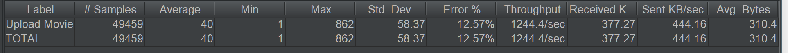

# 测试结果报告

## 流程步骤及工具

1. 开发后端
   * IntelliJ IDEA：Java编程语言开发的集成环境。
   * Spring Boot：由Pivotal团队提供的全新框架，其设计目的是用来简化新Spring应用的初始搭建以及开发过程。
2. 配置数据库
   * MySQL：关系型数据库管理系统，由瑞典MySQL AB公司开发，属于Oracle旗下产品。
   * MongoDB：基于分布式文件存储的数据库，介于关系数据库和非关系数据库之间的产品。
   * MariaDB：数据库管理系统，是MySQL的一个分支。
   * SQL Server：Microsoft公司推出的关系型数据库管理系统。
   * Navicat Premium 15：可多重连接的数据库管理工具。
3. 性能测试
   * JMeter：Apache组织开发的基于Java的压力测试工具。

## 测试用例

* 上传电影

通过POST请求上传10299条电影记录，每条电影记录的数据格式如下，并发量为100。

```json
{
    "movieName": "xxx", // 电影名
    "releaseTime": "yyyy-MM-dd", // 上映日期
    "poster": "xxx", // 海报
    "introduction": "xxx" // 介绍
}
```

* 查看电影

通过GET请求获取10299条电影记录，请求参数为movieName（电影名），并发量为1000。

## 运行结果


<center>图1 上传电影（MySQL）</center>


<center>图2 查看电影（MySQL）</center>


<center>图3 上传电影（MongoDB）</center>


<center>图4 查看电影（MongoDB）</center>



<center>图5 上传电影（MariaDB）</center>


<center>图6 查看电影（MariaDB）</center>


<center>图7 上传电影（SQL Server）</center>


<center>图8 查看电影（SQL Server）</center>

## 性能对比

<center>
     
     
</center>

<center>图9 不同场景下各数据库平均时延、吞吐量对比</center>

